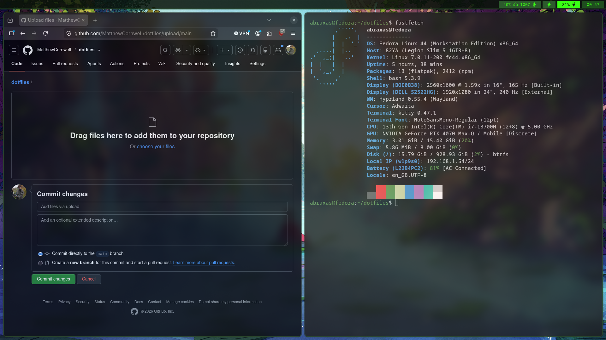

# Dotfiles for my Fedora / Hyprland setup



Personal config for Fedora running Hyprland. Managed with GNU Stow, so editing a file at its normal path (e.g. `~/.config/hypr/hyprland.lua`) is the same as editing it in this repo

- Hyprland (Lua config, 0.55+)
- waybar, wofi, kitty for bar/launcher/terminal
- swww for wallpaper, rotating on a timer
- micro as editor, with wl-clipboard + cliphist for clipboard
- hyprpolkitagent + xdg-desktop-portal-gtk for auth/file picker support
- Green colour scheme across waybar, kitty, borders

## Fresh install

```
git clone git@github.com:MatthewCornwell/dotfiles.git ~/dotfiles
bash ~/dotfiles/install.sh
```

## Day to day

- Edit configs normally (`hyprconf`, `waybarconf`, etc.)
- `dotpush` — commit and push changes
- `dotpull` — pull latest onto another machine
- `dotstatus` — check what's changed

## Adding a new app's config

```
dotadd <package-name> <path-to-real-file>
```

Example:
```
dotadd rofi ~/.config/rofi/config.rasi
```

Moves the file into the repo, mirrors its real path, symlinks it back with Stow.

## Packages tracked

- `hypr` — Hyprland config
- `waybar` — status bar
- `kitty` — terminal
- `wofi` — launcher
- `micro` — editor settings + colorschemes
- `fastfetch` — system info
- `portals` — xdg-desktop-portal
- `scripts` — personal scripts
- `bash` — `.bashrc`

Note: tuned to my specific hardware, `install.sh` and monitor config will need adjusting on different hardware.
```
